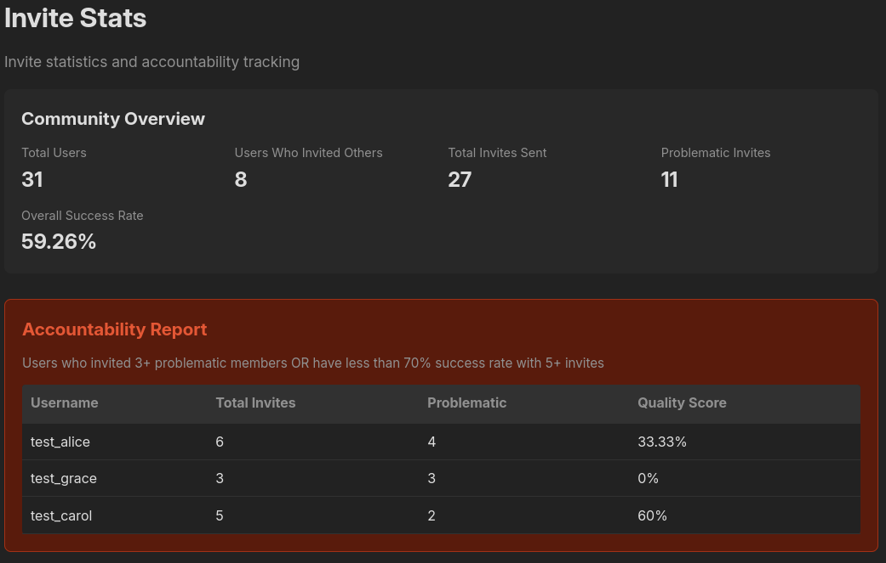
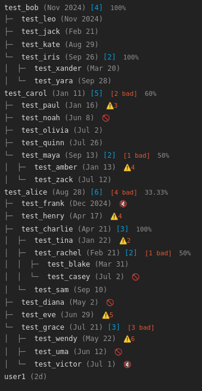

# Discourse Invite Stats

A Discourse plugin for tracking invite statistics and accountability. Shows who invited whom, displays moderation metrics, and helps identify problematic inviters through quality scores and success rate tracking.





## Features

**Accountability & Moderation:**
- Invite quality scores (percentage of non-problematic invites)
- Problematic inviter detection (3+ bad invites or <70% success rate)
- Community-wide summary statistics
- Moderation indicators (suspended, silenced, flagged users)
- Track invite success rates over time

**Visualization:**
- Clean ASCII tree showing invite hierarchy
- Lobsters-style tree characters
- Join dates and invite counts
- Works with invite-only or open registration
- Fully responsive design

## Installation

Add this repository URL to your Discourse plugin list in `app.yml`:

```yaml
hooks:
  after_code:
    - exec:
        cd: $home/plugins
        cmd:
          - git clone https://github.com/ducks/discourse-invite-stats.git
```

Then rebuild your container:

```bash
./launcher rebuild app
```

## Configuration

After installation, go to **Admin > Settings > Plugins > discourse-invite-stats**:

### Basic Settings
- `invite_stats_enabled`: Enable or disable invite stats (default: false)
- `invite_stats_allowed_groups`: Groups allowed to view invite stats (default: empty, allows all logged-in users, staff always have access)
- `invite_stats_show_stats`: Show user statistics (default: true)

### Threshold Settings
Configure when users are flagged as problematic inviters:

- `invite_stats_problematic_threshold`: Number of problematic invites before flagging (default: 3, range: 1-10)
- `invite_stats_quality_threshold`: Minimum quality score percentage before flagging (default: 70, range: 0-100)
- `invite_stats_min_invites_for_quality`: Minimum invites required before quality score applies (default: 5, range: 1-20)
- `invite_stats_flags_threshold`: Number of agreed flags to mark a user as problematic (default: 3, range: 1-10)

These settings allow you to customize problematic inviter detection to match your community's moderation standards.

### Access Control

By default, all logged-in users can view invite stats. You can restrict access by:

1. Adding groups to the `invite_stats_allowed_groups` setting
2. Only users in those groups (or staff) will have access
3. Leave empty to allow all logged-in users

### Invite-Only Mode

To enable invite-only registration, use Discourse's native setting at **Admin >
Settings > Login**:

- `invite_only`: Restrict registration to invited users only

## Usage

Once enabled, invite stats are accessible at `/invite-stats` on your forum.

The page displays three main sections:

### 1. Community Overview
Summary statistics showing:
- Total users and inviters
- Total invites sent
- Number of problematic invites
- Overall success rate

### 2. Accountability Report
Prominently displays users who invited problematic members:
- Users who invited too many problematic users (configurable threshold)
- Users with low quality scores when they have enough invites (configurable thresholds)
- Shows total invites, problematic count, and quality score
- Helps moderators identify patterns and review invite privileges
- Thresholds can be customized in plugin settings

### 3. Invite Tree Visualization
ASCII tree showing the complete invite hierarchy:
- Usernames with links to profiles
- Join dates and invite counts
- Tree structure showing who invited whom
- Moderation indicators: 🚫 suspended, 🔇 silenced, ⚠️ flagged
- Quality scores for users with invites
- Problematic invite counts

**What counts as problematic?**
A user is considered problematic if they are:
- Suspended
- Silenced
- Have enough agreed flags from moderators (configurable threshold, default: 3)

## How It Works

The plugin uses Discourse's native invite system:
- Queries the `invited_users` and `invites` tables
- Joins with `user_stats` for moderation data (flags, suspensions, silences)
- Calculates invite quality scores based on problematic user ratios
- Builds a recursive tree structure from invite relationships
- Includes all users (even problematic ones) for accountability visibility
- Caches results for 1 hour for performance
- Limited to 5000 users for safety on large sites

## Development

### Local Setup

1. Clone to your Discourse plugins directory:
   ```bash
   cd ~/discourse/plugins
   git clone https://github.com/ducks/discourse-invite-stats.git
   ```

2. Start your development Discourse instance

3. Enable the plugin in settings

### Test Data

Generate test invite data with moderation scenarios:

```bash
cd ~/discourse
bin/rails runner plugins/discourse-invite-stats/scripts/create-test-data.rb
```

This creates 40+ test users with:
- Multiple generations of invite relationships
- Suspended, silenced, and flagged users
- Variety of quality scores (from 0% to 100%)
- Problematic inviters that trigger accountability alerts

## Customization

The plugin is designed to be easily customizable:

- **Styling**: Override `.invite-stats-*` CSS classes
- **Tree characters**: Modify `treePrefix` getter in `invite-stats-node.gjs`
- **Thresholds**: Configure in Admin > Settings > Plugins (no code changes needed)
- **Display format**: Edit component templates to show different data
- **Color scheme**: Uses Discourse CSS variables, adapts to themes automatically

## License

MIT

## Author

Jake Goldsborough

## Contributing

Issues and pull requests welcome!
